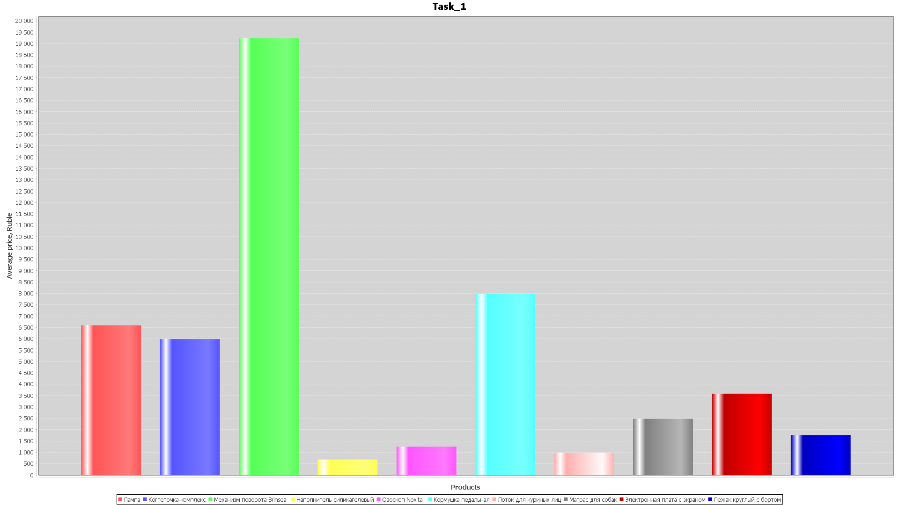
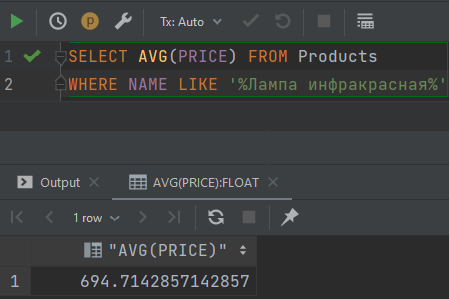
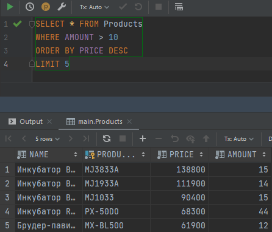
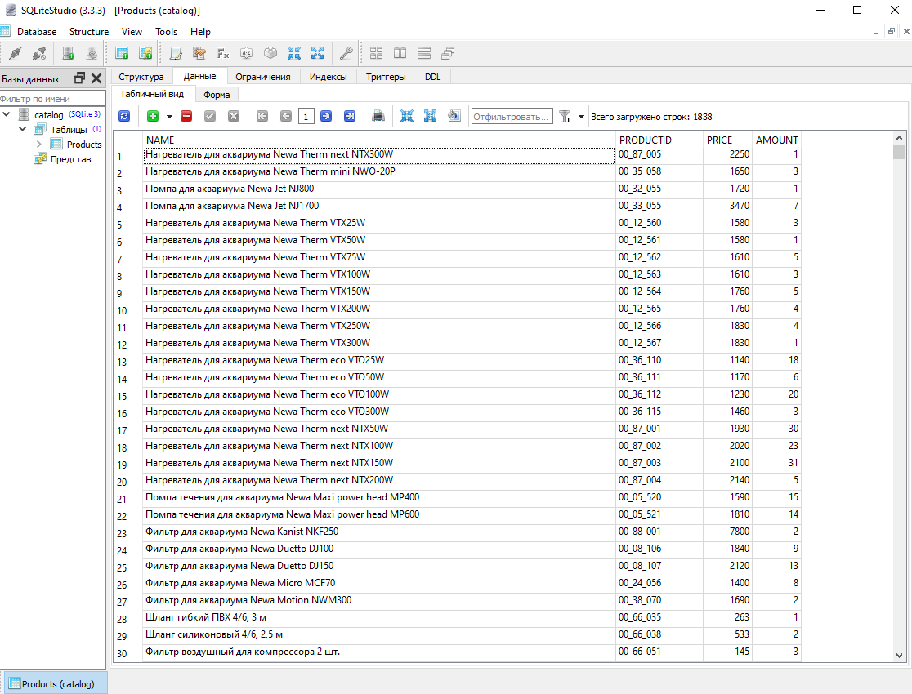

Задание номер 1. Создаём гистограмму средних цен товаров, имеющих несколько разновидностей

Задание номер 2.С помощью SQL запросов находим среднюю стоимость инфракрасной лампы 

Задание номер 3.C помощью SQL запросов берём всю информацию о 5 самых дорогих товаров, которых на складе больше 10

Последовательность работы по проекту:

1.Создаём базы данных и класс DataBaseConnection, где содержится метод с помощью которого создаётся подключение к базе данных

2.Создаём класс Product где описываем сущность продукта в каталоге (название, айди, цены, а также количества продуктов)

3.Создаём класс CsvTools, где обрабатываем функционал парсинга csv файлов в list(Заполнение базы данных)

4.Создаём класс DataBaseGear, где прописываем взаимодействие с базой данных, обновление баз данных

5.Создаём класс Main где присоединяемся к базе данных sqllite, парсим в класс Product все из файла catalog.csv, а также создаём гистограмму товаров и их средней цены, при помощи вызовов в базу данных sqllite

